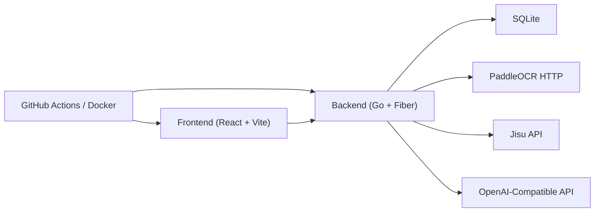

<div align="center">

# 彩迹 Lottery

<p>
  <strong>移动优先的彩票管理、录票、推荐与验奖系统</strong>
</p>

<p>
  用一套完整、可扩展的工程化系统，管理每一次选号、每一张票据、每一期开奖与每一次中奖结果。
</p>

<p>
  <a href="./README.en.md">English</a> ·
  <a href="./docs/system-design.md">系统设计</a> ·
  <a href="./backend/docs/swagger.yaml">Swagger</a>
</p>

<p>
  
  
  
  
  
</p>

</div>

---

## 项目定位

`彩迹` 不是一个“预测彩票”的噱头项目，而是一套围绕真实使用场景构建的系统：

- 管理推荐号码
- 记录购买票据
- 同步官方开奖结果
- 自动判断是否中奖与中奖金额
- 长期沉淀个人购彩历史与数据统计

它优先服务于移动端使用体验，同时保留完整的 Web 与 Docker 部署能力。

## 为什么是这个项目

大多数彩票类工具只做其中一段流程，例如：

- 只看推荐，不记录购买
- 只拍照识别，不做后续判奖
- 只同步开奖结果，不沉淀个人历史

`彩迹` 把这几段流程串成了一条完整闭环：

1. 系统按配置定时生成推荐
2. 用户基于推荐或手工选号购票
3. 上传票据原图并 OCR 辅助录入
4. 系统自动同步开奖结果
5. 票据与推荐自动完成结算和归档

## 核心特性

### 推荐

- 按彩种配置的 `cron` 自动生成推荐
- 不同彩种支持不同模型、提示词、推荐数量、历史窗口
- 根据开奖日历自动推断目标期号和开奖日期
- 同一用户、同一彩种、同一期号重复生成时自动覆盖
- 支持“隐览”全屏号码模式

### 录票

- 上传原图并永久保留
- OCR 自动识别彩种、期号、开奖日期、号码、倍数、金额
- OCR 仅做辅助填写，保存前可全部人工修正
- 支持从推荐直接记录购买
- 自动校验重复票据，避免重复入库

### 开奖与判奖

- 定时同步当期开奖结果
- 支持手动补录历史开奖
- 自动判奖、重新判奖
- 支持双色球、大乐透不同规则
- 大乐透支持追加投注识别与判奖逻辑

### 账户与隔离

- 推荐、上传记录、票据、统计都按用户隔离
- 不同用户之间不会互相看到数据
- 适合长期个人使用，也具备多用户扩展基础

## 当前支持的彩票

| Code | 名称 | 第三方 ID | 规则 |
| --- | --- | --- | --- |
| `ssq` | 福彩双色球 | `11` | 红球 `6 (1-33)`，蓝球 `1 (1-16)` |
| `dlt` | 体彩大乐透 | `13` | 前区 `5 (1-35)`，后区 `2 (1-12)` |

所有彩种能力都从配置读取，核心入口见：

- [backend/config/config.yaml](./backend/config/config.yaml)
- [backend/config/config.local.example.yaml](./backend/config/config.local.example.yaml)

## 体验设计

前端围绕手机使用做了收敛，当前主页面只有 4 个一级入口：

- `看板`：账户信息、核心统计、版本号
- `推荐`：推荐列表、分组、筛选、详情、购买关联
- `记录`：上传、识别、修正、保存的一体化流程
- `历史`：简洁卡片、筛选排序、动态分页、详情与重新判奖

整体原则是：

- 减少解释性噪音
- 优先信息密度
- 保证单手操作
- 保留“快速隐藏”的查看方式

## 系统架构



### 后端职责

- 彩种配置加载
- 推荐任务调度
- 开奖同步
- OCR 接入与文本解析
- 票据入库与重复校验
- 自动判奖与重新判奖
- Swagger 与静态前端托管

### 前端职责

- 移动优先的业务界面
- 推荐、录票、历史等主流程操作
- 图片上传、识别编辑、详情展示
- 版本显示与部署结果确认

## 技术栈

| 层 | 技术 |
| --- | --- |
| Frontend | React, Vite, TypeScript |
| Backend | Go, Fiber, GORM |
| Database | SQLite |
| OCR | PaddleOCR HTTP 服务 |
| AI Recommendation | OpenAI-Compatible API |
| Draw Data | 极速数据 API |
| Deploy | Single Docker Image + Docker Compose |

## 目录结构

```text
.
├─ backend/
│  ├─ cmd/                 # 服务启动入口
│  ├─ config/              # YAML 配置
│  ├─ docs/                # Swagger 生成产物
│  ├─ internal/
│  │  ├─ api/              # HTTP 接口
│  │  ├─ model/            # 数据模型
│  │  └─ service/lottery/  # 彩票领域核心逻辑
│  └─ pkg/                 # 配置、数据库、日志等基础设施
├─ frontend/               # React 前端
├─ docs/                   # 架构与设计文档
├─ scripts/                # Docker 构建与推送脚本
├─ Dockerfile              # 单镜像构建
├─ docker-compose.yml      # 部署编排
└─ .env.example            # Compose 环境变量示例
```

## 快速开始

### 本地开发

本地开发不依赖 Docker。

#### 1. 准备配置

复制本地配置：

```powershell
Copy-Item backend/config/config.local.example.yaml backend/config/config.local.yaml
```

至少需要补这些关键项：

- `jwt.secret`
- `jisu.appKey`
- `ai.baseURL`
- `ai.apiKey`
- `vision.baseURL`
- `vision.apiKey`

#### 2. 启动后端

```powershell
cd backend
go run ./cmd
```

或直接使用热更新脚本：

```powershell
.\scripts\dev-backend.ps1
```

默认地址：

- API: [http://127.0.0.1:25610](http://127.0.0.1:25610)
- Swagger: [http://127.0.0.1:25610/swagger/index.html](http://127.0.0.1:25610/swagger/index.html)

#### 3. 启动前端

```powershell
cd frontend
pnpm install
pnpm dev
```

或直接使用前端开发脚本：

```powershell
.\scripts\dev-frontend.ps1
```

默认地址：

- Frontend: [http://127.0.0.1:3000](http://127.0.0.1:3000)

## Docker 部署

项目采用“整个系统单镜像”的发布方式。

镜像中包含：

- Go 后端可执行文件
- Swagger 文档
- 已构建的前端静态资源

前端静态资源由后端直接托管，不依赖额外的静态站点容器。

### 1. 准备 Compose 环境变量

```powershell
Copy-Item .env.example .env
```

### 2. 启动

```powershell
docker compose up -d --build
```

默认访问：

- App: [http://127.0.0.1:25610](http://127.0.0.1:25610)
- Swagger: [http://127.0.0.1:25610/swagger/index.html](http://127.0.0.1:25610/swagger/index.html)

### 3. 宿主机持久化

默认挂载：

- `./backend/config -> /app/config`
- `./backend/data -> /app/data`
- `./backend/log -> /app/log`

这意味着以下内容都可以在容器外保留和覆盖：

- `config.yaml`
- `config.local.yaml`
- SQLite 数据库文件
- 上传的彩票原图
- 服务日志

## 自动构建镜像

仓库已经集成 GitHub Actions：

- [docker-image.yml](./.github/workflows/docker-image.yml)

默认行为：

- `push main`：自动校验、构建并推送镜像
- `push tag`：自动构建并推送版本镜像
- `pull_request`：只校验和构建，不推送
- `workflow_dispatch`：支持手动触发

镜像仓库：

```text
ghcr.io/ydfk/lottery
```

前端版本号会随镜像构建自动更新：

- `main` 分支：`YYYYMMDD-HHMMSS-<short sha>`
- Git 标签：直接显示标签名

## 常用接口

### 认证

- `POST /api/auth/login`
- `POST /api/auth/register`
- `GET /api/auth/profile`

### 推荐

- `GET /api/lotteries/recommendations`
- `GET /api/lotteries/:code/recommendations`
- `GET /api/lotteries/:code/recommendations/:recommendationId`
- `POST /api/lotteries/:code/recommendations/generate`

### 票据

- `POST /api/lotteries/tickets/upload-image`
- `POST /api/lotteries/tickets/recognize`
- `POST /api/lotteries/tickets`
- `POST /api/lotteries/tickets/import`
- `GET /api/lotteries/tickets/history`
- `POST /api/lotteries/tickets/:ticketId/recheck`

### 开奖同步

- `POST /api/lotteries/:code/draws/sync`
- `POST /api/lotteries/:code/draws/sync-history`
- `POST /api/lotteries/draws/sync-history`

## 测试与构建

### 后端

```powershell
cd backend
go test ./...
```

### 前端

```powershell
cd frontend
pnpm build
pnpm test:run
```

## 批量导入说明

系统支持通过 Excel 批量导入历史票据，适合一次性补录大量已购买号码。

模板文件：

- [ticket-import-template.xlsx](./docs/ticket-import-template.xlsx)

模板生成脚本：

- [generate_ticket_import_template.go](./backend/scripts/generate_ticket_import_template.go)

当前导入规则：

- 一行就是一注号码
- 不再区分“单注模板”和“多注模板”
- 同一用户、同一彩票类型、同一期号的多行，会自动合并成一条购买记录
- 图片可选；如果同时上传图片 ZIP，会按 `图片名` 列和 ZIP 内文件名关联
- 推荐无需手填，系统会自动匹配

推荐自动关联规则：

- 先按 `彩票类型 + 期号` 找候选推荐
- 再比对号码是否匹配
- 只比较 `红球 + 蓝球`
- 不比较 `倍数` 和 `追加`
- 如果一条购买记录里有多注号码，只要其中完整包含某条推荐的全部号码，就会自动关联该推荐

推荐的 Excel 列：

- `彩票类型`
- `期号`
- `开奖日期`
- `购买时间`
- `红球`
- `蓝球`
- `倍数`
- `追加`
- `金额`
- `备注`
- `图片名`

调用方式：

```bash
curl -X POST "http://127.0.0.1:25610/api/lotteries/tickets/import" \
  -H "Authorization: Bearer <token>" \
  -F "workbook=@./docs/ticket-import-template.xlsx"
```

如果同时上传图片：

```bash
curl -X POST "http://127.0.0.1:25610/api/lotteries/tickets/import" \
  -H "Authorization: Bearer <token>" \
  -F "workbook=@./docs/ticket-import-template.xlsx" \
  -F "imagesZip=@./tickets-images.zip"
```

## 适合谁使用

如果你希望有这样一套系统，这个项目会很适合：

- 想长期记录自己的彩票购买与中奖历史
- 想把“推荐、购票、判奖”做成一条完整链路
- 想用 OCR 辅助录票，但又保留人工校正能力
- 想以 Docker 方式稳定部署到自己的服务器
- 想继续扩展更多彩种、更多推荐模型、更多统计维度

## 后续方向

- 更多彩种扩展
- 更细的推荐效果分析
- 更丰富的中奖统计维度
- 更稳的 OCR 识别与资源控制
- 更完整的包描述、截图和演示材料

## GitHub

目标仓库：

```text
git@github.com:ydfk/lottery.git
```

如果本地还没有远程仓库：

```powershell
git remote add origin git@github.com:ydfk/lottery.git
git branch -M main
git push -u origin main
```
